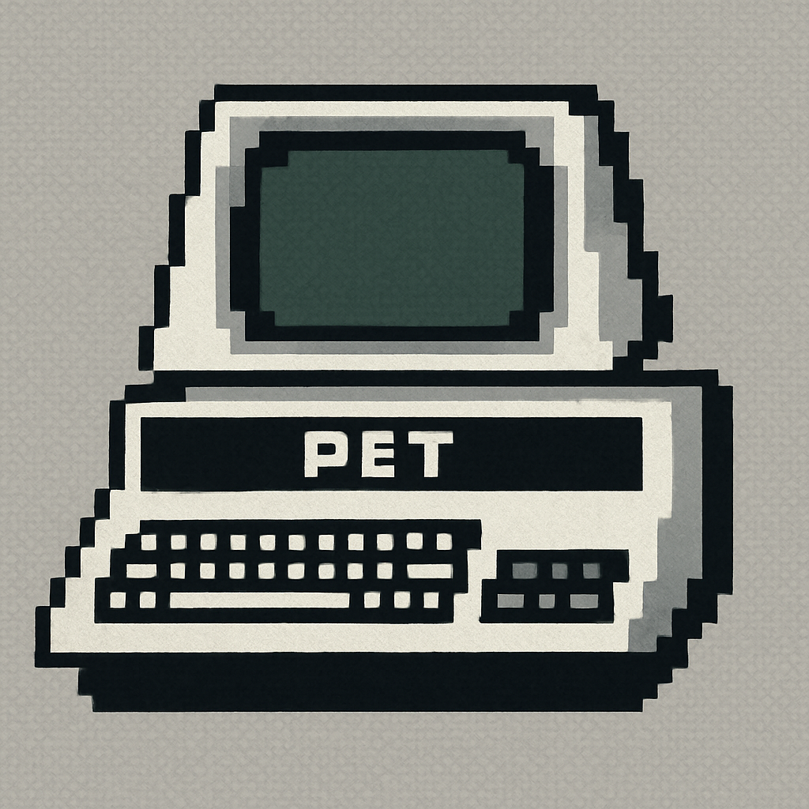
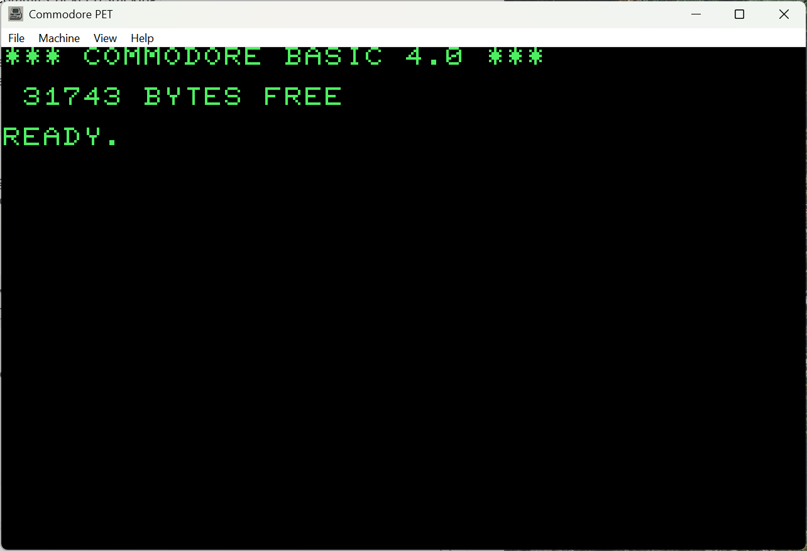
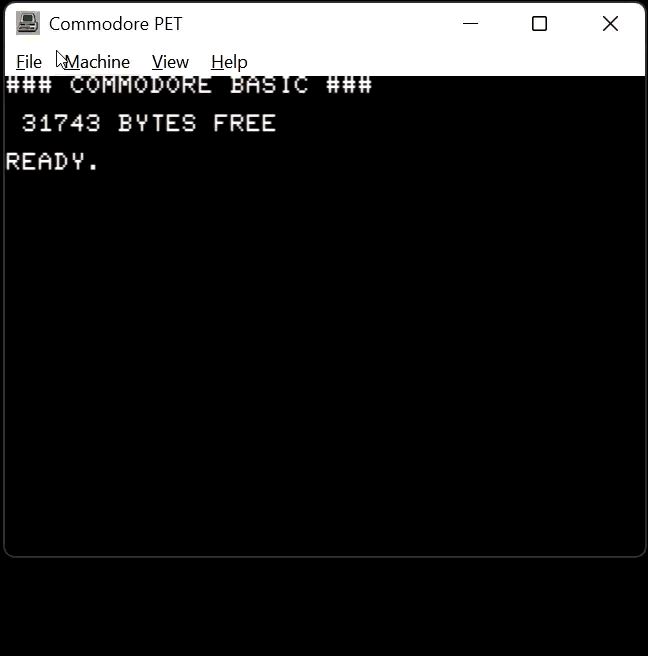
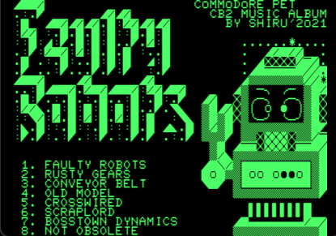

<p align="center">
  
</p>

<h1 align="center">Pet-GPT — Commodore PET 2001 Emulator</h1>

<p align="center">
  A modern, modular Commodore PET emulator for Windows — cycle-driven 6502, accurate
  VIA&nbsp;6522 / PIA&nbsp;6520 I/O, full CB2 sound, a mono-monitor CRT shader,
  <strong>PET&nbsp;8032 40/80-column</strong> modes, SNES&nbsp;user-port gamepad support, and a
  bug-fixed HLE IEEE-488 disk drive with <strong>.d64 and .d71</strong> images. Now
  <strong>version&nbsp;2.5</strong>.
</p>

<p align="center">
  <a href="LICENSE"></a>
  
  
  
  
</p>

<p align="center">
  
</p>

<p align="center">
  
</p>

<p align="center">
  <a href="images/PetGPT-Robots.mp4">
    
  </a>
  <br>
  <a href="images/PetGPT-Robots.mp4">▶ Watch: the Faulty Robots CB2 sound demo running in Pet-GPT</a> <em>(video with audio)</em>
</p>

---

The **Commodore PET 2001** (1977) was Commodore's first personal computer: a 6502 running
Microsoft BASIC, a 40×25 green-phosphor monochrome display, an IEEE-488 disk bus, and a
chunky chiclet keyboard. **Pet-GPT** recreates it in clean, modular C++17 with a reusable
Win32/OpenGL host shell.

**Version 2.0** was a ground-up rewrite of the hardware the original release only roughed
in: a cycle-driven **6502**, an accurate **VIA 6522** with **CB2 shift-register sound**, a
rewritten **PIA 6520** I/O core, **full PCM sound**, **SNES user-port gamepad** support, and
a **bug-fixed HLE disk drive**.

**Version 2.5** builds on that with the business machines and the mono CRT look:

- **PET 8032** support — selectable **40- and 80-column** modes with a functional **MOS 6545
  CRTC**,
- a **mono-monitor CRT shader** (VICE-style softness + halation, green or B&W, live-tunable),
- **.d71** (1571 double-sided) disk images, read **and** write, plus DOS **block/direct-access
  commands** (the Zork/Infocom disk API),
- a proper **4:3** display (fullscreen no longer stretches), a **2× speed** toggle, and the
  **SNES adapter** exposed as a menu option.

> ⚠️ **ROMs are not included.** Pet-GPT ships no Commodore ROM images. You must supply your
> own legally-obtained PET BASIC / EDIT / KERNAL / character ROMs — a bundled script can fetch
> them for you (see [Running](#-running)).

---

## ✨ Features

- 🧠 **6502 CPU core** — full documented + undocumented opcode set, IRQ/NMI, decimal mode
  (synced byte-for-byte with the AAE core).
- 🎛️ **Accurate VIA 6522** — timers, shift register, CA/CB handshakes, interrupt logic,
  datasheet-accurate (tier-2, test-first).
- 🔌 **Rewritten PIA 6520 ×2** — PET keyboard scan, IEEE handshake lines, screen-retrace IRQ.
- 🔊 **Full CB2 sound** — the VIA shift-register / CB2 line is reconstructed to PCM in real
  time, so the classic PET sound demos (e.g. *Faulty Robots*) play correctly.
- 🖳 **PET models** — **2001N (BASIC 2)**, **BASIC 4 (40-column)**, and **8032 (80-column)**
  with a functional **MOS 6545 CRTC** and CRTC-derived frame timing.
- 📺 **Mono CRT shader** — VICE-style horizontal softness + halation glow, **green phosphor**
  or **black & white**, with beam-overdrive contrast and black-level lift. Live-tunable
  (F9 / PgUp-PgDn / F8) and saved to `pet.ini`.
- 🎮 **SNES gamepad support** — an emulated SNES user-port adapter maps an Xbox/XInput pad
  (or WinMM joystick) to PETSCII-Robots-style games. Toggle in **Machine ▸ SNES Adapter**.
- 💾 **HLE IEEE-488 disk drive (device 8), fully bug-fixed**
  - Mounts **.d64** (1541, 35-track) **and .d71** (1571 double-sided, 70-track) images —
    read **and** write (SAVE / SCRATCH / RENAME / COPY / NEW).
  - **DOS block / direct-access commands** — `OPEN "#"` buffer channels, `U1`/`U2` block
    read/write, `B-P`, `B-A`/`B-F` — the API Zork-style Infocom interpreters use.
  - SEQ / PRG / USR named-file reads with CBM wildcards; append (`,A`) and `@`-replace.
  - **Virtual drive**: serves a host folder (`./files`) as device 8 — `LOAD"NAME",8`,
    `LOAD"$",8`, with a real 1541-style directory listing.
  - Persists across resets; ejectable back to the virtual drive at any time.
- 🖥️ **Real desktop app** — native menus, integer & free window scaling, proper **4:3**
  presentation, Alt-Enter fullscreen, drag-and-drop loading, and `.ini`-persisted settings.
- ⚡ **2× speed** toggle for slow text adventures; **direct PRG loading** (BASIC programs are
  re-linked so `RUN` just works; the machine reboots cleanly first).

---

## 🧰 Requirements

| | |
|---|---|
| **OS** | Windows 10 / 11 (x64) |
| **Toolchain** | Visual Studio 2022 (Desktop C++ workload), C++17 |
| **GPU** | OpenGL 3.3 core profile |
| **Audio** | XAudio2 (ships with Windows) |
| **Bundled** | GLEW, stb_image (in `petemu/thirdparty/`) |

---

## 🔨 Building

Open the solution in Visual Studio 2022 and build **Release · x64**:

```text
PetEmu.sln  →  Configuration: Release  ·  Platform: x64  →  Build
```

…or from a Developer PowerShell:

```powershell
msbuild PetEmu.sln /t:Build /p:Configuration=Release /p:Platform=x64 /m
```

The binary is produced at `x64\Release\PetEmu.exe`.

To run the standalone unit tests — eight suites (VIA 6522, SNES adapter, CB2 sound,
D64/D71 disk, host viewport, PET video, MOS 6545 CRTC, PRG relink):

```powershell
petemu\tests\run_tests.bat
```

---

## ▶️ Running

Pet-GPT runs from the executable's directory and needs two folders next to `PetEmu.exe`:

### `roms/` — your Commodore ROM dumps (Pet-GPT ships none)

ROM sets live in **per-model subfolders**, each self-contained:

```text
x64\Release\roms\
├─ basic2\   PET 2001N  (BASIC 2.0)
├─ basic4\   BASIC 4.0, 40-column
└─ 8032\     BASIC 4.0, 80-column (8032)
```

**Easiest way — the fetch script.** From the release folder, run the bundled downloader; it
pulls every set from **zimmers.net** (the canonical Commodore firmware archive) into the
right subfolders:

```powershell
cd x64\Release
.\download-roms.ps1                 # all three sets
.\download-roms.ps1 -Sets Basic4    # just one (Basic2 | Basic4 | 8032)
```

**By hand** — download the plain `.bin` files from the
[zimmers PET folder](https://www.zimmers.net/anonftp/pub/cbm/firmware/computers/pet/) and drop
them into the matching subfolder (no extraction needed). Each set also needs the two shared
character ROMs (`characters-1.901447-08.bin`, `characters-2.901447-10.bin`):

| Folder | ROMs |
|---|---|
| `roms\basic2\` | `basic-2-c000.901465-01.bin`, `basic-2-d000.901465-02.bin`, `edit-2-n.901447-24.bin`, `kernal-2.901465-03.bin` + chars |
| `roms\basic4\` | `basic-4-b000.901465-23.bin`, `basic-4-c000.901465-20.bin`, `basic-4-d000.901465-21.bin`, `edit-4-n.901447-29.bin`, `kernal-4.901465-22.bin` + chars |
| `roms\8032\` | `basic-4-b000.901465-19.bin`, `basic-4-c000.901465-20.bin`, `basic-4-d000.901465-21.bin`, `edit-4-80-b-60Hz.901474-03.bin`, `kernal-4.901465-22.bin` + chars |

Pick the model at runtime with **Machine ▸ Model**, `-basic2` / `-basic4`, or `[machine] basic`
in `pet.ini`.

### `files/` — your programs and disks (the virtual drive root)

Drop `.prg`, `.d64`, and `.d71` files here, then `LOAD"NAME",8` / `LOAD"$",8` from BASIC, or
use **File ▸ Load** (or drag-and-drop onto the window).

Then just launch:

```powershell
x64\Release\PetEmu.exe
```

### Command line (optional)

```text
PetEmu.exe [program] [options]
  -basic2 | -basic4     select the ROM set
  -disk <file>          mount a .d64 / .d71, or prime a .prg from ./files
  -rom <file>           load a program/disk at startup
  -scale <1|2|3|fit>    initial window scale       -fullscreen | -window
  -h                    help
```

---

## ⌨️ Controls

The PC keyboard maps onto the PET 8×10 key matrix. Highlights:

| PET key | PC key |
|---|---|
| `RUN/STOP` | `Caps Lock` |
| `STOP` + restore (**BREAK**) | `Caps Lock` + `Shift` |
| Cursor ↑ / ↓ | `↑` / `↓` |
| Cursor ← / → | `Shift +` `↑/↓` (PET has 2 cursor keys) |
| `CLR/HOME` | `Home` |
| Graphics ⇄ business charset | `F12`* |

\* In graphics mode, `Shift`+letter emits the PETSCII graphic for that key. Also toggleable
in **Machine ▸ Graphics Keyboard**.

### 🎮 Gamepad (SNES user-port adapter)

Plug in an Xbox/XInput controller (or any WinMM joystick) and Pet-GPT presents it to the PET
as an **SNES adapter on the user port** — the scheme PETSCII Robots and similar games use.
D-Pad and the face/shoulder/start/select buttons are mapped automatically. Enable or disable
it in **Machine ▸ SNES Adapter** (persisted as `[input] snes_adapter`); the data-line invert
lives in `pet.ini` (`[input] snes_invert`).

---

## ⚡ Hotkeys

| Key | Action |
|---|---|
| `Ctrl+O` | Load program / disk… |
| `Ctrl+E` | Eject disk (back to the `./files` virtual drive) |
| `Ctrl+R` | Reset |
| `F10` | Toggle CRT look (mono monitor shader) |
| `F9` / `PgUp` / `PgDn` | Select a CRT shader knob / adjust it |
| `F8` | Dump the current CRT shader values to the log |
| `F12` | Toggle graphics ⇄ business keyboard |
| `F11` / `Alt+Enter` | Toggle fullscreen |
| `Esc` | Leave fullscreen, or quit |

---

## 📂 Menus

```text
File ─┬─ Load Program/Disk…   (Ctrl+O)
      ├─ Eject Disk           (Ctrl+E)
      ├─ Reset                (Ctrl+R)
      └─ Exit
Machine ─┬─ Model ▸ PET 2001N / 8032 (40 Column) / 8032 (80 Column)   (radio)
         ├─ Memory ▸ 4K / 8K / 16K / 32K                              (radio)
         ├─ 2× Speed                                                  (checkbox)
         ├─ Graphics Keyboard    (F12)                                (checkbox)
         └─ SNES Adapter                                              (checkbox)
View ─┬─ Scale 1× / 2× / 3× / Fit
      ├─ CRT Monitor Settings…   (shader enable, green/B&W, and knobs)
      └─ Fullscreen              (Alt+Enter)
Help ─── About
```

Files can also be **drag-and-dropped** onto the window.

---

## ⚙️ Configuration

Settings live in `pet.ini` next to the executable and are written back on exit:

| Section / key | Values | Notes |
|---|---|---|
| `[machine] basic` | `2`, `4`, `8` | ROM set: 2001N / BASIC 4 40-col / 8032 80-col |
| `[machine] ram` | `4`, `8`, `16`, `32` | RAM size in KB (default 32) |
| `[machine] speed2x` | `0`/`1` | 2× emulation speed |
| `[input] snes_adapter` | `0`/`1` | emulate the user-port SNES pad |
| `[input] snes_invert` | `0`/`1` | invert the adapter data line |
| `[input] graphics_kbd` | `0`/`1` | Shift+letter types PET graphics chars |
| `[video] scale` | `0`=Fit, `1`/`2`/`3` | window scale preset |
| `[video] fullscreen` | `0`/`1` | start fullscreen |
| `[video] crt` | `0`/`1` | mono-monitor CRT shader |
| `[video] crt_tint` | `0`/`1` | green phosphor (`1`) vs black & white (`0`) |
| `[video] mono_blur_h` · `mono_blur_v` | float | horizontal / vertical softness |
| `[video] mono_halation` · `mono_halation_radius` | float | glow amount / radius |
| `[video] mono_contrast` · `mono_brightness` | float | beam overdrive / black-level lift |
| `[video] mono_scanline` | float | soft raster-line ripple (0 = off) |
| `[paths] lastromdir` | path | remembered Load… directory |

The CRT knobs are best set live from **View ▸ CRT Monitor Settings** (or F9 / PgUp-PgDn); F8
dumps the current values to the log as a paste-ready block.

---

## 🗂️ Project layout

```text
Pet-GPT-2026/
├─ PetEmu.sln
├─ petemu/
│  ├─ pet_host_app.cpp         # thin WinMain → host shell
│  ├─ emulator.cpp             # machine wiring, ROM loading, frame loop
│  ├─ system/                  # reusable Win32/OpenGL host shell (window, menu, scaling)
│  ├─ petsrc/                  # PET hardware: 6502, VIA 6522, PIA 6520, 6545 CRTC, video, IEEE/D64/D71
│  ├─ sys_audio/               # mixer + CB2 → PCM reconstruction
│  ├─ sys_general/ sys_gl/     # logging, GL 3.3 core context
│  ├─ tools/                   # download-roms.ps1 (fetch ROM sets from zimmers.net)
│  ├─ thirdparty/              # GLEW, stb_image
│  └─ tests/                   # standalone unit tests (run_tests.bat)
└─ x64/Release/
   ├─ roms/                    # ← ROM dumps, in basic2/ basic4/ 8032/ subfolders
   └─ files/                   # ← put .prg / .d64 / .d71 here (virtual drive)
```

---

## 👥 Contributors

- **Tim Cottrill** ([@tcottrill](https://github.com/tcottrill)) — author, integrator, maintainer.
- Built with AI pair-programming: **ChatGPT** (original 1.0) and **Claude** (the 2.0 rewrite
  and 2.5 — VIA/PIA, sound, SNES, HLE disk, 8032/CRTC, the CRT shader, and the host shell).

## 🙏 Acknowledgements

- **Thomas Skibo** — his JavaScript Commodore PET emulator was the architectural starting point.
- **MAME / MESS** developers — PET timing, IEEE-488 structure, and memory-map validation.
- **Michael Steil** — [cbmbus](https://github.com/mist64/cbmbus_doc) IEEE-488 / Commodore DOS notes.
- **unusedino.de** — the canonical [D64 format reference](http://unusedino.de/ec64/technical/formats/d64.html).
- **zimmers.net** — the canonical Commodore firmware archive the ROM downloader pulls from.
- The PET community for ROM documentation and the sound/joystick demos used as test cases.

---

## 📜 License

Released under the **GNU General Public License v3.0**.

```text
Pet-GPT — Commodore PET 2001 Emulator
Copyright (C) 2026 Tim Cottrill

This program is free software: you can redistribute it and/or modify it under the
terms of the GNU General Public License as published by the Free Software Foundation,
either version 3 of the License, or (at your option) any later version.

This program is distributed in the hope that it will be useful, but WITHOUT ANY
WARRANTY; without even the implied warranty of MERCHANTABILITY or FITNESS FOR A
PARTICULAR PURPOSE. See the GNU General Public License for more details.
```

Commodore ROM images are **not** distributed with this project and remain the property of
their respective rights holders. Bundled third-party libraries (GLEW, stb_image) retain
their own licenses.
