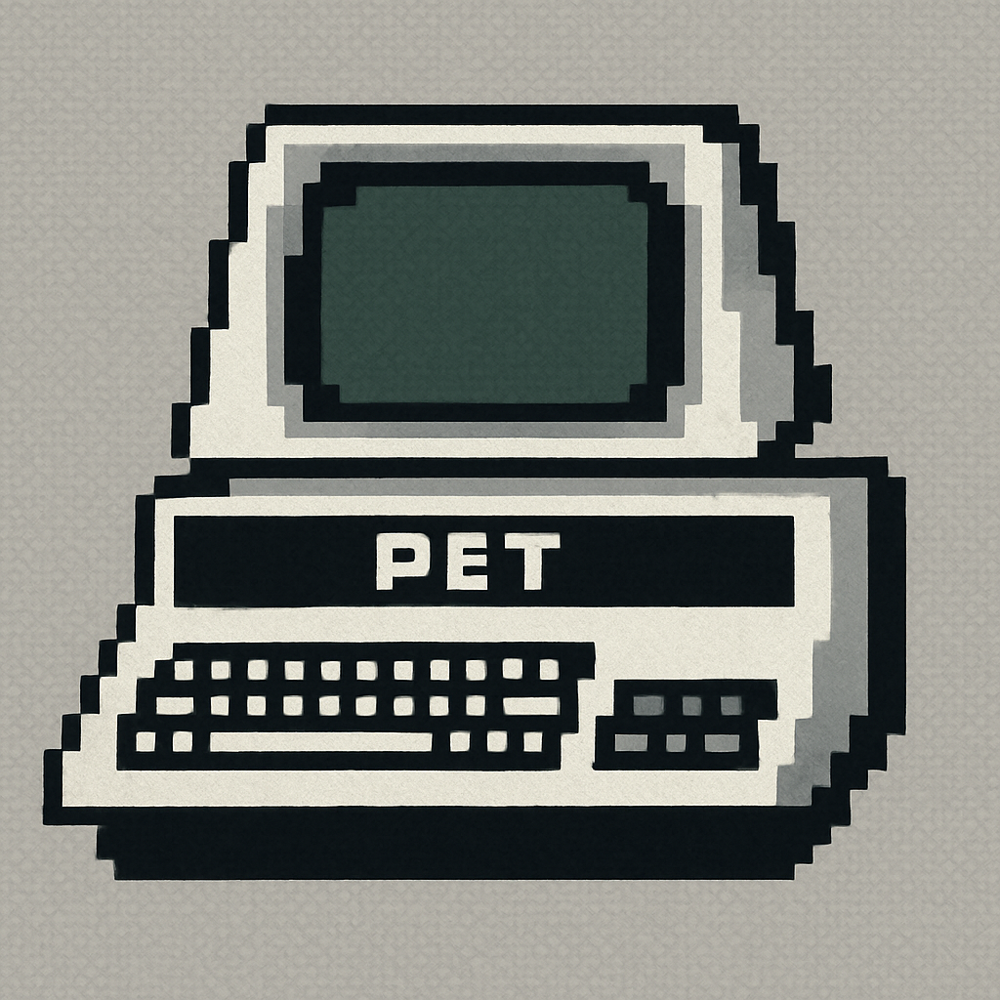
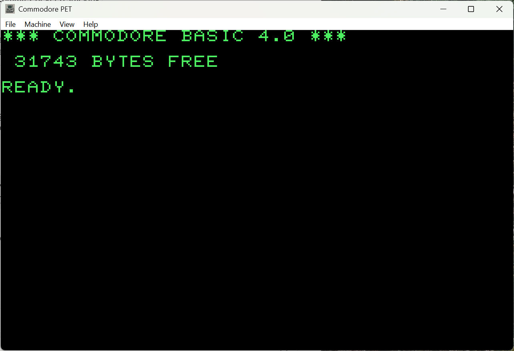
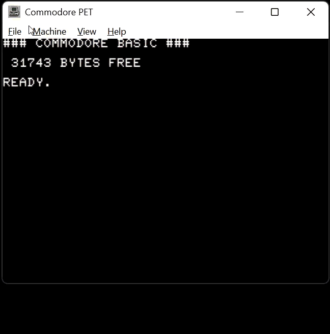

<p align="center">
  
</p>

<h1 align="center">Pet-GPT — Commodore PET/CBM Emulator</h1>

<p align="center">
  Note to anyone actually stumbling on this repository, this actually is a halfway decent
  pet emulator, and the hle disk drive handles about 95% of the use cases. I am really happy with
  it and if you give it a couple of minutes I think you will be too. The 6502 core and via6522
  have been highly debugged and are suitable for using in just about any other C++ project.<br>
  ...
  A modern, modular Commodore PET emulator for Windows — cycle-driven 6502, accurate
  VIA&nbsp;6522 / PIA&nbsp;6520 I/O, full CB2 sound, a mono-monitor CRT shader,
  <strong>five PET/CBM models</strong> from the original 2001 to the 80-column 8032,
  <strong>.tap cassette playback</strong> and <strong>.t64</strong> loading, SNES&nbsp;user-port
  gamepad support, and a bug-fixed HLE IEEE-488 disk drive with <strong>.d64 and .d71</strong>
  images. Now <strong>version&nbsp;2.6</strong>.
</p>

<p align="center">
  <a href="LICENSE"></a>
  
  
  
  
</p>

<p align="center">
  
</p>

<p align="center">
  
</p>

**▶ The _Faulty Robots_ CB2 sound demo running in Pet-GPT (video, with audio):**

https://github.com/user-attachments/assets/0e11d07d-d96a-43b2-86fe-575940d97524

<sub>If the player above doesn't load (some mirrors strip it), <a href="images/PetGPT-Robots.mp4">click here to watch the video</a>.</sub>

---

The **Commodore PET 2001** (1977) was Commodore's first personal computer: a 6502 running
Microsoft BASIC, a 40×25 green-phosphor monochrome display, an IEEE-488 disk bus, and a
chunky chiclet keyboard. **Pet-GPT** recreates it in clean, modular C++17 with a reusable
Win32/OpenGL host shell.

**Version 2.0** was a ground-up rewrite of the hardware the original release only roughed
in: a cycle-driven **6502**, an accurate **VIA 6522** with **CB2 shift-register sound**, a
rewritten **PIA 6520** I/O core, **full PCM sound**, **SNES user-port gamepad** support, and
a **bug-fixed HLE disk drive**.

**Version 2.5** builds on that with the business machines and the mono CRT look:

- **PET 4000 / CBM 8032** support — selectable **40- and 80-column** machines with a functional **MOS 6545
  CRTC**,
- a **mono-monitor CRT shader** (VICE-style softness + halation, green or B&W, live-tunable),
- **.d71** (1571 double-sided) disk images, read **and** write, plus DOS **block/direct-access
  commands** (the Zork/Infocom disk API),
- a proper **4:3** display (fullscreen no longer stretches), a **2× speed** toggle, and the
  **SNES adapter** exposed as a menu option.

**Version 2.6** — *the one with the features* — fills out the family tree and adds tape:

- **Five machine models** — the **original PET 2001** (BASIC 1, 8 KB), **2001N / 3000**
  (BASIC 2), **4000 9-inch** (BASIC 4, discrete video), the new **4000 12-inch** (40-column
  **CRTC**, 60 Hz), and the **CBM 8032** (80-column) — all from **Machine ▸ Model**.
- **TAP cassette playback** — attach a `.tap` to cassette port 1 and drive it from
  **File ▸ Tape** (Play / Stop / Rewind / Eject); the real PET ROM does the loading.
- **T64 archive loading** — single-program archives load directly; multi-program archives
  show a picker.
- **ROM sets reorganized** into one folder per model, with an updated `download-roms.ps1`
  that fetches all five (old set names still accepted).
- A broad accuracy and robustness pass across the 6502, VIA, CRTC video and the disk drive.

> ⚠️ **ROMs are not included.** Pet-GPT ships no Commodore ROM images. You must supply your
> own legally-obtained PET BASIC / EDIT / KERNAL / character ROMs — a bundled script can fetch
> them for you (see [Running](#-running)).

---

## ✨ Features

- 🧠 **6502 CPU core** — full documented + undocumented opcode set, IRQ/NMI, decimal mode
  (synced byte-for-byte with the AAE core).
- 🎛️ **Accurate VIA 6522** — timers, shift register, CA/CB handshakes, interrupt logic,
  datasheet-accurate (tier-2, test-first).
- 🔌 **Rewritten PIA 6520 ×2** — PET keyboard scan, IEEE handshake lines, screen-retrace IRQ.
- 🔊 **Full CB2 sound** — the VIA shift-register / CB2 line is reconstructed to PCM in real
  time, so the classic PET sound demos (e.g. *Faulty Robots*) play correctly.
- 🖳 **PET models** — **original 2001 (BASIC 1, 8 KB)**, **2001N/3000 (BASIC 2)**,
  **4000 9-inch (BASIC 4)**, **4000 12-inch CRTC**, and **8032 (80-column)**; the CRTC models
  use a functional **MOS 6545 CRTC** with CRTC-derived frame timing.
- 📼 **TAP cassette playback** — `.tap` v0/v1 images on cassette port 1, read by the real PET
  ROM at tape speed, with motor control and a **File ▸ Tape** transport.
- 📦 **T64 archives** — load a program straight into RAM, with a picker for multi-program
  archives.
- 📺 **Mono CRT shader** — VICE-style horizontal softness + halation glow, **green phosphor**
  or **black & white**, with beam-overdrive contrast and black-level lift. Live-tunable
  (F9 / PgUp-PgDn / F8) and saved to `pet.ini`.
- 🎮 **SNES gamepad support** — an emulated SNES user-port adapter maps an Xbox/XInput pad
  (or WinMM joystick) to PETSCII-Robots-style games. Toggle in **Machine ▸ SNES Adapter**.
- 💾 **HLE IEEE-488 disk drive (device 8), fully bug-fixed**
  - Mounts **.d64** (1541, 35-track) **and .d71** (1571 double-sided, 70-track) images —
    read **and** write (SAVE / SCRATCH / RENAME / COPY / NEW).
  - **DOS block / direct-access commands** — `OPEN "#"` buffer channels, `U1`/`U2` block
    read/write, `B-P`, `B-A`/`B-F` — the API Zork-style Infocom interpreters use.
  - SEQ / PRG / USR named-file reads with CBM wildcards; append (`,A`) and `@`-replace.
  - **Virtual drive**: serves a host folder (`./files`) as device 8 — `LOAD"NAME",8`,
    `LOAD"$",8`, with a real 1541-style directory listing.
  - Persists across resets; ejectable back to the virtual drive at any time.
- 🖥️ **Real desktop app** — native menus, integer & free window scaling, proper **4:3**
  presentation, Alt-Enter fullscreen, drag-and-drop loading, and `.ini`-persisted settings.
- ⚡ **2× speed** toggle for slow text adventures; **direct PRG loading** (BASIC programs are
  re-linked so `RUN` just works; the machine reboots cleanly first).

---

## 🧰 Requirements

| | |
|---|---|
| **OS** | Windows 10 / 11 (x64) |
| **Toolchain** | Visual Studio 2022 (Desktop C++ workload), C++17 |
| **GPU** | OpenGL 3.3 core profile |
| **Audio** | XAudio2 (ships with Windows) |
| **Bundled** | GLEW, stb_image (in `petemu/thirdparty/`) |

---

## 🔨 Building

Open the solution in Visual Studio 2022 and build **Release · x64**:

```text
PetEmu.sln  →  Configuration: Release  ·  Platform: x64  →  Build
```

…or from a Developer PowerShell:

```powershell
msbuild PetEmu.sln /t:Build /p:Configuration=Release /p:Platform=x64 /m
```

The binary is produced at `x64\Release\PetEmu.exe`.

To run the standalone unit tests — TAP cassette, T64 archive, keyboard, 6502 CPU, VIA 6522,
SNES adapter, CB2 sound, D64/D71 disk, host viewport, PET video, MOS 6545 CRTC, machine
models, and PRG relink:

```powershell
petemu\tests\run_tests.bat
```

---

## ▶️ Running

Pet-GPT runs from the executable's directory and needs two folders next to `PetEmu.exe`:

### `roms/` — your Commodore ROM dumps (Pet-GPT ships none)

ROM sets live in **per-model subfolders**, each self-contained:

```text
x64\Release\roms\
├─ pet2001\     Original PET 2001, BASIC 1, 8 KB, original character ROM
├─ pet2001n\    PET 2001N / 3000, BASIC 2, discrete video
├─ pet4000-9\   PET 4000, 9-inch, BASIC 4, discrete video
├─ pet4000-12\  PET 4000, 12-inch, BASIC 4, 40-column CRTC, 60 Hz
└─ cbm8032\     CBM 8032, BASIC 4, 80-column CRTC, 60 Hz
```

**Easiest way — the fetch script.** From the release folder, run the bundled downloader; it
pulls every set from **zimmers.net** (the canonical Commodore firmware archive) into the
right subfolders:

```powershell
cd x64\Release
.\download-roms.ps1                 # all five sets
.\download-roms.ps1 -Sets Pet4000-12   # just the new 12-inch model
```

**By hand** — download the plain `.bin` files from the
[zimmers PET folder](https://www.zimmers.net/anonftp/pub/cbm/firmware/computers/pet/) and drop
them into the matching subfolder (no extraction needed). Each set also needs the two shared
character ROMs (`characters-1.901447-08.bin`, `characters-2.901447-10.bin`):

| Folder | ROMs |
|---|---|
| `roms\pet2001\` | Seven `rom-1-*.901447-0*.bin` ROMs (C000, C800, D000, D800, E000, F000, F800) plus `characters-1.901447-08.bin` |
| `roms\pet2001n\` | `basic-2-c000.901465-01.bin`, `basic-2-d000.901465-02.bin`, `edit-2-n.901447-24.bin`, `kernal-2.901465-03.bin` + chars |
| `roms\pet4000-9\` | `basic-4-b000.901465-23.bin`, `basic-4-c000.901465-20.bin`, `basic-4-d000.901465-21.bin`, `edit-4-n.901447-29.bin`, `kernal-4.901465-22.bin` + chars |
| `roms\pet4000-12\` | Same BASIC/KERNAL/character ROMs as pet4000-9, with `edit-4-40-n-60Hz.901499-01.bin` replacing the editor |
| `roms\cbm8032\` | `basic-4-b000.901465-19.bin`, `basic-4-c000.901465-20.bin`, `basic-4-d000.901465-21.bin`, `edit-4-80-b-60Hz.901474-03.bin`, `kernal-4.901465-22.bin` + chars |

Pick the model at runtime with **Machine ▸ Model**, `-pet2001` / `-basic2` / `-basic4` / `-4032` / `-8032`, or `[machine] basic`
in `pet.ini`. Existing values 2/4/8 retain their meaning; 12 selects the new CRTC model.

The 4000 models cover 4016/4032 configurations according to RAM size (default 32 KB; smaller
sizes are custom configurations). The original PET 2001 uses BASIC 1 and 8 KB RAM. Only the
12-inch 4000 and the 8032 have the CRTC. Banked 8096/8296 models are not implemented.

> **Upgrading from 2.5?** Inside `roms`, rename `basic2` → `pet2001n`, `basic4` → `pet4000-9`,
> and `8032` → `cbm8032` — or just run `download-roms.ps1` again. The downloader still accepts
> the old set names as aliases.

### `files/` — your programs and disks (the virtual drive root)

Drop `.prg`, `.d64`, and `.d71` files here, then `LOAD"NAME",8` / `LOAD"$",8` from BASIC, or
use **File ▸ Load** (or drag-and-drop onto the window). File ▸ Load also accepts `.t64`
archives and `.tap` cassette images (see [TAP cassette playback](#-tap-cassette-playback)).

Then just launch:

```powershell
x64\Release\PetEmu.exe
```

### 📦 T64 archives

**File ▸ Load** and drag-and-drop accept `.t64` archives. A single-program archive loads
directly; an archive with several programs shows a picker. Type `RUN` after loading a BASIC
program. Programs keep their original load address and must be PET-compatible. T64 loading
extracts the program straight into RAM — it has no cassette timing and isn't mounted on the
disk drive; use TAP playback for software that reads more from tape.

### 📼 TAP cassette playback

Use **File ▸ Load** or drag a `.tap` onto the window to attach it to cassette port 1.
Type `LOAD` and press Return, then select **File ▸ Tape (cassette 1) ▸ Play**.
The PET ROM reads the tape at emulated tape speed; type `RUN` when loading finishes.
Stop pauses at the current position. Rewind stops and returns to the beginning;
press Play to resume. Eject removes the image. Reset stops playback and preserves
the tape position. Tape motor control pauses playback automatically between reads.

Read-only TAP versions 0 and 1 are supported, including extended v1 pulses and
legacy C64-clock captures of PET tapes. The contents must be PET-compatible.
TAP v2 half-wave images, recording/SAVE, and cassette port 2 are not implemented.
An invalid image leaves the previous tape and running machine intact.
TAP is separate from the IEEE disk drive and the `-disk` option.

### Command line (optional)

```text
PetEmu.exe [program] [options]
  -pet2001 | -basic2 | -basic4 | -4032 | -8032   select the machine profile
  -disk <file>          mount a .d64 / .d71, or prime a .prg from ./files
  -rom <file>           load a program/disk at startup
  -scale <1|2|3|fit>    initial window scale       -fullscreen | -window
  -h                    help
```

---

## ⌨️ Controls

The PC keyboard maps onto the PET 8×10 key matrix. Highlights:

| PET key | PC key |
|---|---|
| `RUN/STOP` | `Caps Lock` |
| `STOP` + restore (**BREAK**) | `Caps Lock` + `Shift` |
| Cursor ↑ / ↓ | `↑` / `↓` |
| Cursor ← / → | `←` / `→` (sent as the PET's shifted/unshifted cursor key) |
| `HOME` / `CLR` | `Home` / `Shift`+`Home` |
| Graphics ⇄ business charset | `F12`* |

\* In graphics mode, `Shift`+letter emits the PETSCII graphic for that key. Also toggleable
in **Machine ▸ Graphics Keyboard**.

Open **Machine ▸ Keyboard Mapping...** for a Windows-style keyboard diagram.
The window fits the current monitor and can be resized or maximized; its keys,
labels, and controls scale together. **Show Shift mappings** previews alternate
functions for the current PET model and typing mode.

Click a key and choose its PET assignment, then **Apply** or **OK** to save it to
`pet.ini`. **Cancel** discards changes made since the last Apply. You can clear an
assignment, restore one key, or restore all defaults. Gray keys are reserved for
host/system controls; Ctrl+O/E/R and Alt+Enter remain emulator shortcuts.

### 🎮 Gamepad (SNES user-port adapter)

Plug in an Xbox/XInput controller (or any WinMM joystick) and Pet-GPT presents it to the PET
as an **SNES adapter on the user port** — the scheme PETSCII Robots and similar games use.
D-Pad and the face/shoulder/start/select buttons are mapped automatically. Enable or disable
it in **Machine ▸ SNES Adapter** (persisted as `[input] snes_adapter`); the data-line invert
lives in `pet.ini` (`[input] snes_invert`).

---

## ⚡ Hotkeys

| Key | Action |
|---|---|
| `Ctrl+O` | Load program / disk… |
| `Ctrl+E` | Eject disk (back to the `./files` virtual drive) |
| `Ctrl+R` | Reset |
| `F10` | Toggle CRT look (mono monitor shader) |
| `F9` / `PgUp` / `PgDn` | Select a CRT shader knob / adjust it |
| `F8` | Dump the current CRT shader values to the log |
| `F12` | Toggle graphics ⇄ business keyboard |
| `F11` / `Alt+Enter` | Toggle fullscreen |
| `Esc` | Leave fullscreen, or quit |

---

## 📂 Menus

```text
File ─┬─ Load Program/Disk/Tape…   (Ctrl+O)
      ├─ Eject Disk                (Ctrl+E)
      ├─ Tape (cassette 1) ▸ Play / Stop / Rewind / Eject Tape
      ├─ Reset                     (Ctrl+R)
      └─ Exit
Machine ─┬─ Model ▸ PET 2001 / PET 2001N/3000 / PET 4000 9-inch / PET 4000 12-inch CRTC / CBM 8032   (radio)
         ├─ Memory ▸ 4K / 8K / 16K / 32K                              (radio)
         ├─ 2× Speed                                                  (checkbox)
         ├─ Graphics Keyboard    (F12)                                (checkbox)
         └─ SNES Adapter                                              (checkbox)
View ─┬─ Scale 1× / 2× / 3× / Fit
      ├─ CRT Monitor Settings…   (shader enable, green/B&W, and knobs)
      └─ Fullscreen              (Alt+Enter)
Help ─── About
```

Files can also be **drag-and-dropped** onto the window.

---

## ⚙️ Configuration

Settings live in `pet.ini` next to the executable and are written back on exit:

| Section / key | Values | Notes |
|---|---|---|
| `[machine] basic` | `1`, `2`, `4`, `8`, `12` | Model: original 2001 / 2001N / 4000 9-inch / 8032 / 4000 12-inch |
| `[machine] ram` | `4`, `8`, `16`, `32` | RAM size in KB (default 32; 2001 is fixed at 8; 8032 is fixed at 32) |
| `[machine] speed2x` | `0`/`1` | 2× emulation speed |
| `[input] snes_adapter` | `0`/`1` | emulate the user-port SNES pad |
| `[input] snes_invert` | `0`/`1` | invert the adapter data line |
| `[input] graphics_kbd` | `0`/`1` | Shift+letter types PET graphics chars |
| `[video] scale` | `0`=Fit, `1`/`2`/`3` | window scale preset |
| `[video] fullscreen` | `0`/`1` | start fullscreen |
| `[video] crt` | `0`/`1` | mono-monitor CRT shader |
| `[video] crt_tint` | `0`/`1` | green phosphor (`1`) vs black & white (`0`) |
| `[video] mono_blur_h` · `mono_blur_v` | float | horizontal / vertical softness |
| `[video] mono_halation` · `mono_halation_radius` | float | glow amount / radius |
| `[video] mono_contrast` · `mono_brightness` | float | beam overdrive / black-level lift |
| `[video] mono_scanline` | float | soft raster-line ripple (0 = off) |
| `[paths] lastromdir` | path | remembered Load… directory |

The CRT knobs are best set live from **View ▸ CRT Monitor Settings** (or F9 / PgUp-PgDn); F8
dumps the current values to the log as a paste-ready block.

---

## 🗂️ Project layout

```text
Pet-GPT-2026/
├─ PetEmu.sln
├─ petemu/
│  ├─ pet_host_app.cpp         # thin WinMain → host shell
│  ├─ emulator.cpp             # machine wiring, ROM loading, frame loop
│  ├─ system/                  # reusable Win32/OpenGL host shell (window, menu, scaling)
│  ├─ petsrc/                  # PET hardware: 6502, VIA 6522, PIA 6520, 6545 CRTC, video, IEEE/D64/D71
│  ├─ sys_audio/               # mixer + CB2 → PCM reconstruction
│  ├─ sys_general/ sys_gl/     # logging, GL 3.3 core context
│  ├─ tools/                   # download-roms.ps1 (fetch ROM sets from zimmers.net)
│  ├─ thirdparty/              # GLEW, stb_image
│  └─ tests/                   # standalone unit tests (run_tests.bat)
└─ x64/Release/
   ├─ roms/                    # ← ROM dumps, in pet2001/ pet2001n/ pet4000-9/ pet4000-12/ cbm8032/
   └─ files/                   # ← put .prg / .d64 / .d71 here (virtual drive)
```

---

## 👥 Contributors

- **Tim Cottrill** ([@tcottrill](https://github.com/tcottrill)) — author, integrator, maintainer.
- Built with AI pair-programming: **ChatGPT** (original 1.0) and **Claude** (the 2.0 rewrite
  through 2.6 — VIA/PIA, sound, SNES, HLE disk, the PET/CBM models and CRTC, TAP/T64, the
  CRT shader, and the host shell).

## 🙏 Acknowledgements

- **Thomas Skibo** — his JavaScript Commodore PET emulator was the architectural starting point.
- **MAME / MESS** developers — PET timing, IEEE-488 structure, and memory-map validation.
- **Michael Steil** — [cbmbus](https://github.com/mist64/cbmbus_doc) IEEE-488 / Commodore DOS notes.
- **unusedino.de** — the canonical [D64 format reference](http://unusedino.de/ec64/technical/formats/d64.html).
- **zimmers.net** — the canonical Commodore firmware archive the ROM downloader pulls from.
- The PET community for ROM documentation and the sound/joystick demos used as test cases.

---

## 📜 License

Released under the **GNU General Public License v3.0**.

```text
Pet-GPT — Commodore PET/CBM Emulator
Copyright (C) 2026 Tim Cottrill

This program is free software: you can redistribute it and/or modify it under the
terms of the GNU General Public License as published by the Free Software Foundation,
either version 3 of the License, or (at your option) any later version.

This program is distributed in the hope that it will be useful, but WITHOUT ANY
WARRANTY; without even the implied warranty of MERCHANTABILITY or FITNESS FOR A
PARTICULAR PURPOSE. See the GNU General Public License for more details.
```

Commodore ROM images are **not** distributed with this project and remain the property of
their respective rights holders. Bundled third-party libraries (GLEW, stb_image) retain
their own licenses.
